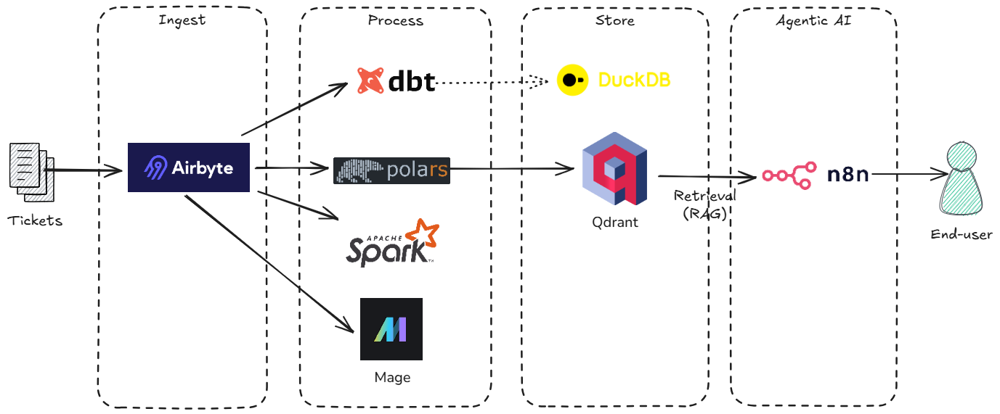

# UPV - Inteligencia Artificial & Big Data Analytics - State of the art tools for Big Data solutions

## Introduction
This repository contains hands-on exercises for the "State of the Art Tools for Big Data" course at UPV's master *Inteligencia Artificial & Big Data Analytics*. The course provides practical experience with cutting-edge Big Data technologies and industry-leading tools.

Throughout this course, you will learn to:
- **Ingest data** using Airbyte
- **Orchestrate workflows** using Mage AI
- **Process data** using Apache Spark SQL
- **Perform single-node processing** using Polars and store data in DuckDB
- **Transform data** using dbt
- **Implement semantic search** by storing data in Qdrant vector databases





## 🚀 Setup Instructions

### Software Requirements

* Docker
* Python
* Visual Studio Code

### Initial Setup

1. Clone this repository
2. Change to the newly created folder
3. Install Airbyte for local use by following the [Airbyte Quickstart Guide](https://docs.airbyte.com/platform/using-airbyte/getting-started/oss-quickstart)
4. Download the latest version of the image files
   ```bash
   docker compose pull
   ```
5. (Option) Launch all services
   ```bash
   docker compose up -d
   ```
