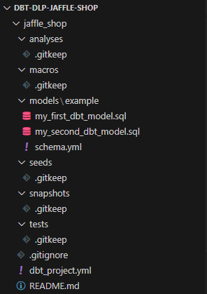

# dbt (Data Build Tool) Practical Excercises

## Introduction

This repo contains the code and instructions for practical exercises that will teach the basics of [**dbt (Data Build Tool)**](https://docs.getdbt.com/docs/introduction#dbt-core), a **transformation workflow tool** designed to help analysts and data engineers **transform and test their data as code**, following software engineering best practices.

For the exercises, we will use **dbt Core**, the open-source command-line tool offered by dbt as a product. dbt Core allows for the quick installation of dbt and [dbt adapters](https://docs.getdbt.com/docs/connect-adapters) as Python libraries, meaning that **having a compatible version of Python is the only requirement to start using dbt**.

By completing these exercises, you will learn about the essential components of dbt's workflow:

- **Models**: these are SQL-based files that define your transformations.
- **Tests**: these can be written to validate assumptions about your data, such as checking for null values, uniqueness, or referential integrity.
- **Documentation**: dbt offers features for documenting your data models and their relationships.

## Practical Excercise - Jaffle Shop

To learn about the dbt core elements, we will use an example with data for a fictional Jaffle Shop.

The Jaffle Shop dataset has data about its **customers**, **orders** and **payments**. The columns for each table, as well as the relationships between them, can be seen in the following Entity Relationship Diagram:

<div style="text-align: center;">
  
</div>

We will create models that will be **materialized as views and tables** in a [**DuckDB**](https://duckdb.org/) database, as seen in the following diagram:

<div style="text-align: center;">
  
</div>

### Excercise setup

Before going into the excercises, it is necessary to setup the dbt project locally.

To do that, you first need to **clone this repository** to your local computer.

We will use Visual Studio Code (VSC) as the Integrated Development Environment (IDE) for the excercises, so the repo can be cloned using the *Open in your IDE* option and selecting *Visual Studio Code (HTTPS)* when cloning the project:

<div style="text-align: center;">
  
</div>

Follow the instructions in VSC, choosing a directory to clone the repo in your computer and making sure you log in to your GitLab account.

After successfully cloning the repo, open it in VSC and open a terminal by clicking choosing *Terminal* 🡢 *New terminal* in the upmost menu.

Once you open the terminal, go to the *PRO-000-dbt* directory:

```
cd Sessions/PRO-Processing/PRO-000-dbt/
```

After that, we need to run a container where dbt Core will be installed and run:

```
docker run --name dbt_container -it -v ${PWD}/src:/app/src -p 8080:8080 python:3.10-slim /bin/bash
```

This command sets up a Python environment, allowing you to work within the container while having access to your local project files located in the src folder.

Here's a breakdown of the options used in this command:

- `docker run`: The main Docker command to run a container from an image.
- `--name dbt_container`: This option names the container `dbt_container` so it can be easily referenced later (e.g., for stopping, starting, or inspecting).
- `-it`: This option attaches an interactive terminal to the container.
- `-v ${PWD}/src:/app/src`: This option mounts a volume from the host machine to the container.
  - `${PWD}/src`: Refers to the current directory's `src` folder on the host machine.
  - `/app/src`: Specifies the target directory inside the container where the folder is mounted. This allows your local files to be accessible within the container.
- `-p 8080:8080`: maps port `8080` on the local machine to port `8080` in the container.
- `python:3.10-slim`: This specifies the image to use. In this case, it pulls the `python:3.10-slim` image, which is a lightweight version of Python 3.10, suitable for installing dbt Core.
- `/bin/bash`: This is the command that runs inside the container, opening a Bash shell for further interaction.

Once the container is running and the Bash shell is open, you can go to the src folder:

```
cd app/src/
```

After navigating to the src folder, use the following command to install the [required libraries](./src/requirements.txt):

```
pip install -r requirements.txt
```

Within the installed libraries, the following are the most important in the context of this setup:

- **`dbt-duckdb~=1.5.0`**: This is the DuckDB adapter for dbt (Data Build Tool). By installing `dbt-duckdb`, you also install `dbt-core`.
- **`duckcli~=0.2.1`**: A command-line interface (CLI) tool for interacting with DuckDB. It provides a convenient way to query, inspect, and manage DuckDB databases directly from the terminal. This tool is especially useful for quickly testing SQL queries or exploring your database.

### Excercise 1: Model Creation

#### Staging Models

- **Objectives**: Create the staging models for all three tables, **stg_customers**, **stg_orders** and **stg_products**, and materialize them as **views** in the DuckDB database.
- **Instructions**:

  - Create a folder named **staging** within the **models** folder for the SQL files that will define the models.
  - Modify the [`dbt_project.yml`](./src/jaffle_shop/dbt_project.yml) file to indicate that models within the staging folder will be materialized as views.
  - Create the SQL model files in the staging folder. **The files name will be the name of the model**. The staging views will simply select all columns from the original raw tables, but renaming some columns:
    - customers:
      - id as customer_id
    - orders:
      - id as order_id
      - user_id as customer_id
    - payment:
      - id as payment_id
      - amount / 100 as amount
  - Create a file named `schema.yml` within the staging folder and write down the columns for all models.
  - Build each model individually or all at once with the `dbt build` command.
  - Check if the views were created by selecting their data in the DuckDB database using duckcli.
- **Commands**:

  - Load CSV files with `dbt seed`:

  ```
  dbt seed
  ```

  - Compile a single model with `dbt build`:

  ```
   dbt build -f -s <model_name>
  ```

  - Compile all models:

  ```
  dbt build
  ```

  - Run duckcli and select from table:

  ```
  cd app/src/jaffle_shop/
  ```

  ```
  duckcli jaffle_shop.duckdb
  ```

  ```
  select * from <table_name>;
  ```

  - Close duckcli:

  ```
  exit
  ```

**Additional info**: By using the `dbt build` command we are running `dbt run` to run the models and `dbt test`, which will validate information in the `schema.yml` file with the data and the model that is being created.

#### Other Models

- **Objectives**: Create the **customers_orders**, **customers_payments** and **customers_orders_payments** models and materialize them as **tables** in the DuckDB database.
- **Instructions**:

  - Modify the [`dbt_project.yml`](./src/jaffle_shop/dbt_project.yml) file to indicate that models within the models folder will be materialized as tables.
  - Create the SQL model files in the models folder. **The files name will be the name of the model**. The created tables will join data from the staging views and will have the following columns:
    | **customers_orders** |
    | -------------------------- |
    | customer_id                |
    | customer_full_name         |
    | first_order                |
    | most_recent_order          |
    | number_of_orders           |

    | **customers_payments** |
    | ---------------------------- |
    | customer_id                  |
    | number_of_orders             |
    | total_amount                 |

    | **customers_orders_payments** |
    | ----------------------------------- |
    | customer_id                         |
    | customer_full_name                  |
    | first_order                         |
    | most_recent_order                   |
    | number_of_orders                    |
    | total_amount                        |
  - Create a file named `schema.yml` within the models folder and write down the columns for all tables.
  - Build each model individually or all at once with the `dbt build` command.
  - Check if the tables were created by selecting their data in the DuckDB database using duckcli.
- **Commands**:

  - Compile a single model with `dbt build`:

  ```
   dbt build -f -s <model_name>
  ```

  - Compile all models:

  ```
  dbt build
  ```

  - Run duckcli and select from table:

  ```
  cd app/src/jaffle_shop/
  ```

  ```
  duckcli jaffle_shop.duckdb
  ```

  ```
  select * from <table_name>;
  ```

  - Close duckcli:

  ```
  exit
  ```

**Additional info**: By using the `dbt build` command we are running `dbt run` to run the models and `dbt test`, which will validate information in the `schema.yml` file with the data and the model that is being created.

- **Useful links**:
  - [dbt Docs on SQL Models](https://docs.getdbt.com/docs/build/sql-models)

### Excercise 2: Tests creation

- **Objective**: Understand dbt's testing capabilities by adding schema tests to ensure data quality.
- **Instructions**:

  - Modify the models `schema.yml` files to add the following tests:
    - Unique and non-null values for all primary keys.
    - Accepted values for orders status: 'placed', 'shipped', 'completed', 'return_pending', 'returned'.
    - Relationships between columns
  - Run `dbt test` command to run the tests.
- **Commands**:

  - Run tests:

  ```
  dbt test
  ```
- **Useful links**:

  - [dbt Docs on Tests](https://docs.getdbt.com/docs/build/data-tests)

### Excercise 3: Documentation creation

- **Objectives**: understand, generate and customize dbt documentation.
- **Instructions**:

  - Generate, run and explore the default documentation by running the `dbt docs generate` and `dbt docs serve` commands.
  - Add descriptions for models and columns in `schema.yml` files.
  - Create a Markdown file named `docs.md` with the description for a field and use it for a column description in the `schema.yml` files.
  - Override the default overview for the documentation web's first page by creating a `overview.md` file.
- **Commands**:

  - Generate documentation:

  ```
  dbt docs generate
  ```

  - Serve documentation in website:

  ```
  dbt docs serve
  ```
- **Useful links**:

  - [dbt Docs on Documentation](https://docs.getdbt.com/docs/build/documentation)

## Extra: Practical Excercise - EventSpark

To put to practice the concept learned with the first practical example, a second one has been prepared.

The [extra_seeds](./extra_seeds/) folder contains a dataset for **a fictional online event management platform** called **EventSpark**, which allows users to create and attend events. This could involve users registering for events, making payments for tickets, and tracking event details.

The dataset includes three tables, **users**, **events**, and **tickets**, with the following ER Diagram:

<div style="text-align: center;">
  
</div>

The new data can be used to practice anything with dbt, but here are some **proposed excercises**:

### 1. **Users Model**:

- **Objective**: Create a `users.sql` model to clean and transform the user data.
- **Example transformations**: clean up email domains, and flag users based on region.

### 2. **Events Model**:

- **Objective**: Create an `events.sql` model to analyze event types and event capacity.
- **Example transformations**: calculate remaining tickets, event attendance rates.

### 3. **Tickets Model**:

- **Objective**: Create a `tickets.sql` model to join ticket sales with users and events.
- **Example transformations**: calculate total revenue per event, group by payment method, or region of users.

### 4. **Model Tests**:

- **Objective**: Add tests to ensure that:
  - `user_id` is unique in the `users` table.
  - `event_id` in the `tickets` table has a corresponding entry in the `events` table (foreign key test).
  - `total_amount` in `tickets.csv` matches `tickets_bought * price_per_ticket` from the `events.csv`.

### 5. **Documentation**:

- **Objective**: Use dbt's `schema.yml` to document each model, for example:
  - Describe `events` as event information including event type, capacity, and location.
  - Describe `tickets` as linking purchases between users and events.

## Extra: dbt project creation

This section shows how the dbt project `jaffle_shop` included in this repo was created for those looking to recreate it or learn how a dbt project is initialized.

First, it is necessary to **install dbt Core and an adapter**, in this case the DuckDB adapter.

To do that, you can **create and activate a Python virtual environment**:

```
python -m venv venv
source venv/Scripts/activate
```

And then, **install all dependencies** in the [`requirements.txt`](./src/requirements.txt) file:

```
pip install -r requirements.txt
```

After that, the dbt project can be created with the `dbt init` command:

```
dbt init jaffle_shop
```

After choosing the adapter to create the project for, the project is created with its initial structure:

<div style="text-align: center;">
  
</div>

A project is usually created with a `profiles.yml` file if there is a default one for the adapter you choose. Since there isn't one for DuckDB, the [`profiles.yml`](./src/jaffle_shop/profiles.yml) file was created with this content:

```yml
jaffle_shop:
  outputs:
    dev:
      type: duckdb
      path: 'jaffle_shop.duckdb'
      threads: 4
  target: dev
```

Indicating that a profile with name *jaffle_shop* is of type *duckdb* and will write data to the path *jaffle_shop.duckdb*.

To finish the setup, the CSV files with the Jaffle Shop data were copied to the [seeds](./src/jaffle_shop/seeds/) directory to be used as the input data for the dbt models.
